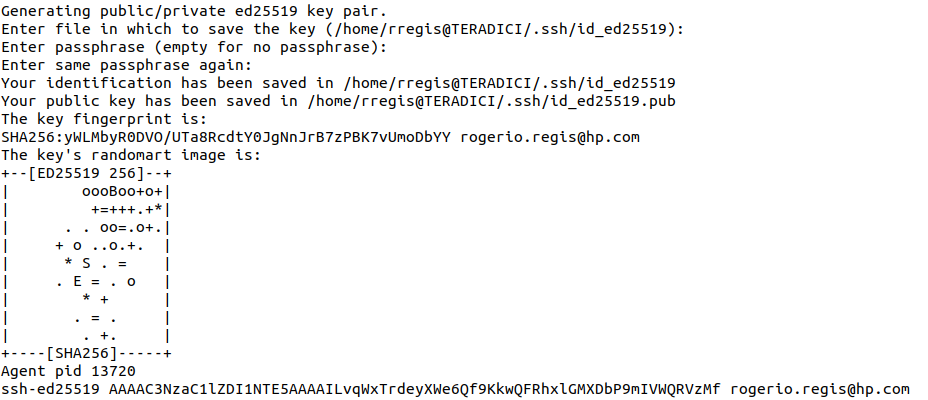
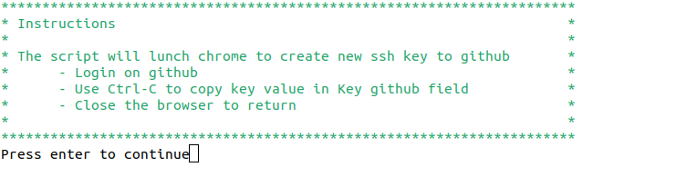
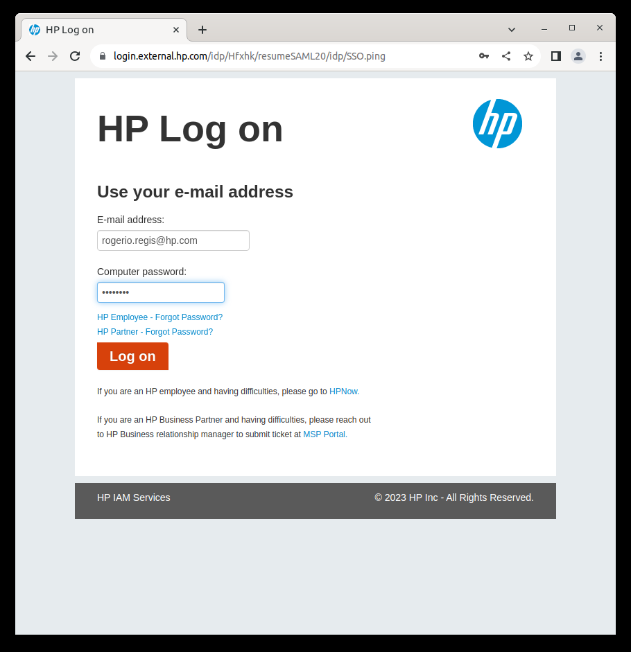
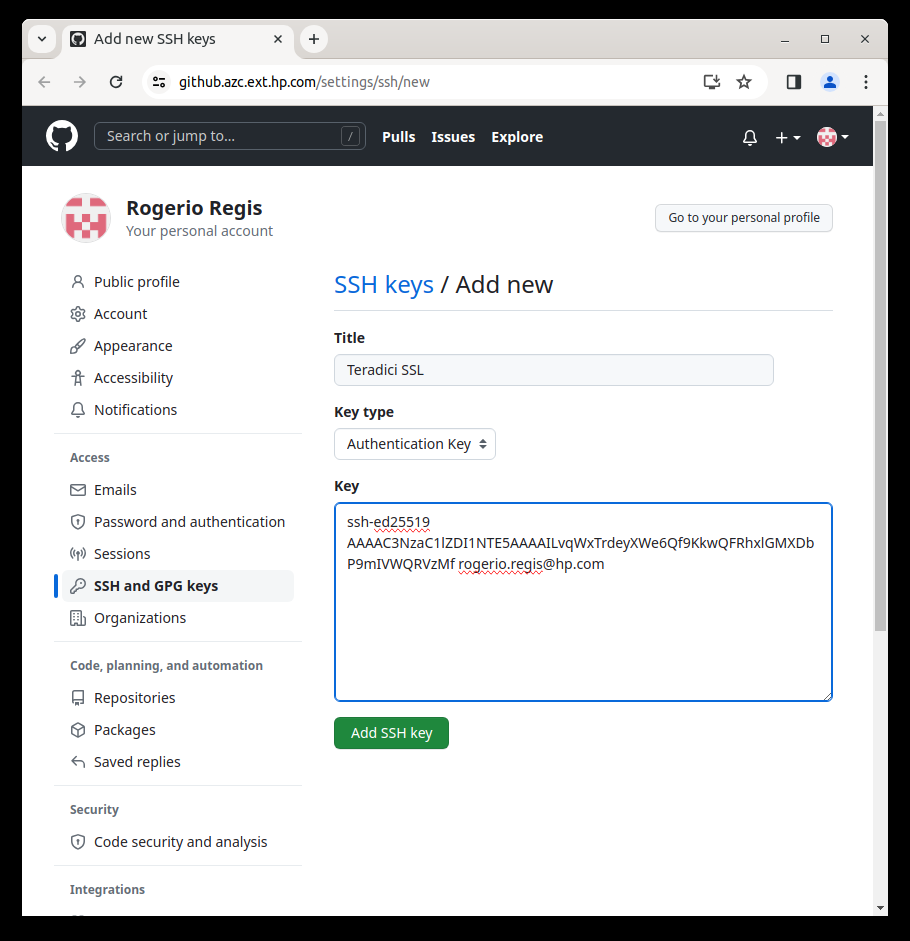
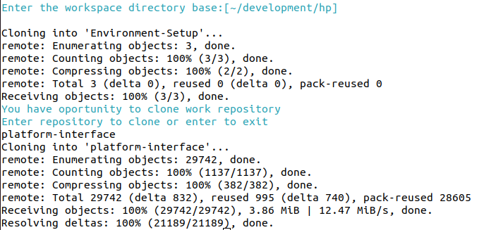

# install_vm.sh 
Installation applications and dependencies for new development virtual machine

1) Updating installed software
1) Necessary packages and containers will be installed
1) Create access Github key
1) Cloning repositories

## Script execution

###### Copy to virtual machine: 
``` bash
curl -fsSL https://raw.github.azc.ext.hp.com/Anyware-Infrastructure/Environment-Setup/main/install/vm/install_vm.sh?token=GHSAT0AAAAAAAACBXIPUCRBA4D7KF3VHZUSZK3OSLA -o install_vm.sh
```

###### Usage: 
``` bash
bash install_vm.sh "<User name>" "<User hp e-mail>"
```


## Examples
	- bash install_vm.sh "Rogerio Regis" "rogerio.regis@hp.com"


## Procedimentos

1) Set environment update and upgrate and dependencies
1) Installation developement software 
	- Firefox
	- Chrome
	- Visual studio code and extensions
	- Notepad ++
1) Installation Docker application
1) Create Github ssl key
1) Create workspace directory base
1) Clone enviroment-setup repository
1) Clone user work repository (optional)
1) Restart system to apply changes (optional)


## Github Install configuration
Cmake option used based on the command 

- Request to installation ssl key. If ok answer with 1 (yes)

	
	
- Creating key using open-ssl

	

- Instructions to create access Github ssl key 

	

- Login on HP Github

	

- Creating access Github ssl key 

	

- Confirmation create access Github key

	


## Clone repository

The script will create the base directory to clone the repositories, suggesting the development/hp directory. Clone the 'Environment-Setup' repository.

Also, if desired, the script will make it possible to clone the working repository.




